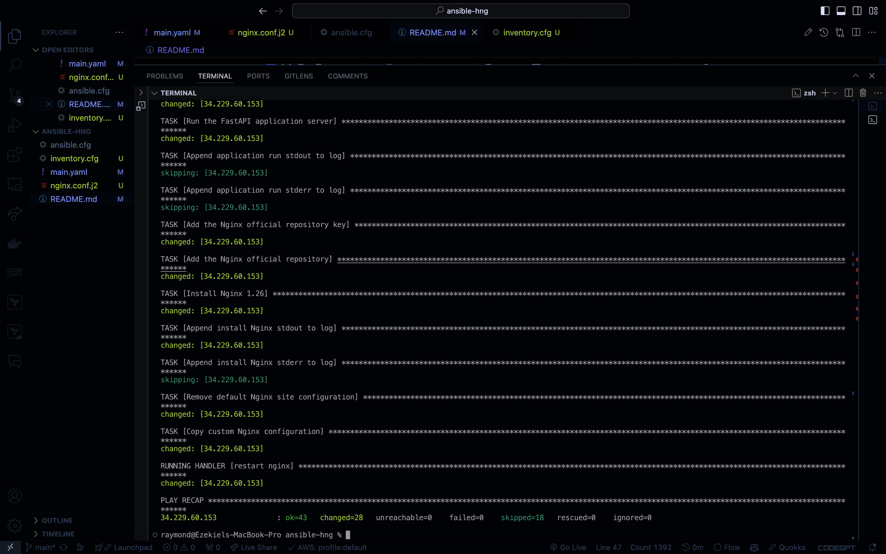

Automated Deployment and Configuration with Ansible for Boilerplates

This repository contains Ansible playbooks and configurations for deploying the HNG boilerplate application using Ansible on an Ubuntu 22.04 server.

## Repository Structure

- `main.yaml`: The main Ansible playbook that automates the deployment of the HNG boilerplate application.
- `ansible.cfg`: Configuration file for Ansible to enable pipelining and other settings.

## Requirements

- Ansible 2.10+
- An Ubuntu 22.04 server
- SSH access to the server with a user that has sudo privileges
- PostgreSQL, Git, Python 3.12, and other dependencies specified in the playbook

## Setup Instructions

1. **Clone this repository**

   ```sh
   git clone https://github.com/yourusername/ansible-hng-boilerplate-deployment.git
   cd ansible-hng-boilerplate-deployment

   ```
2. **Prepare your inventory file**

Create an inventory.cfg file with the following structure:

[hng]
your_server_ip ansible_user=ubuntu ansible_ssh_private_key_file=/path/to/your/private_key.pem

Replace your_server_ip with the IP address of your server and /path/to/your/private_key.pem with the path to your SSH private key.

3. Create ansible.cfg file with the following structure

[defaults]

allow_world_readable_tmpfiles = True

[ssh_connection]

pipelining = True

4. Run the Ansible Playbook
   ansible-playbook main.yaml -b -i inventory.cfg





